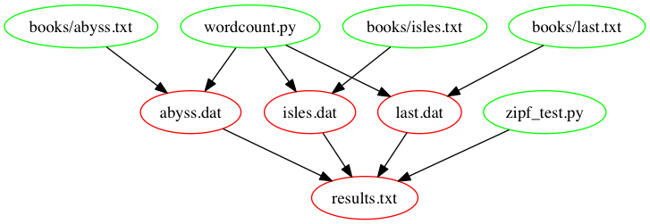

> ## Learning Objectives {.objectives}
>
> * Output files are a product not only of input files but of the
>   scripts or code that created the output files. 
> * Recognise and avoid false dependencies.

Our Makefile now looks like this:

~~~ {.make}
# Count words.
.PHONY : dats
dats : isles.dat abyss.dat last.dat

isles.dat : books/isles.txt
	python wordcount.py $< $@

abyss.dat : books/abyss.txt
	python wordcount.py $< $@

last.dat : books/last.txt
	python wordcount.py $< $@

# Generate archive file.
analysis.tar.gz : *.dat
	tar -czf $@ $^

.PHONY : clean
clean :
        rm -f *.dat
        rm -f analysis.tar.gz
~~~

Our data files are a product not only of our text files but the
script, `wordcount.py`, that processes the text files and creates the
data files. We should add `wordcount.py` as a dependency of each of our
data files also:

~~~ {.make}
isles.dat : books/isles.txt wordcount.py
	python wordcount.py $< $@

abyss.dat : books/abyss.txt wordcount.py
	python wordcount.py $< $@

last.dat : books/last.txt wordcount.py
	python wordcount.py $< $@
~~~

If we pretend to edit `wordcount.py` and re-run Make,

~~~ {.bash}
$ touch wordcount.py
$ make dats
~~~

then we get:

~~~ {.output}
python wordcount.py books/isles.txt isles.dat
python wordcount.py books/abyss.txt abyss.dat
python wordcount.py books/last.txt last.dat
~~~

The following figure shows the dependencies embodied within our Makefile, involved in building the `analysis.tar.gz` target, after adding `wordcount.py` as a dependency to the `.dat` files:

> ## Why don't the `.txt` files depend on `wordcount.py`? {.callout}
>
> `.txt` files are input files and have no dependencies. To make these
> depend on `wordcount.py` would introduce a [false
> dependency](reference.html#false-dependency).

Let's add our analysis script to the archive too:

~~~ {.make}
analysis.tar.gz : *.dat wordcount.py
        tar -czf $@ $^
~~~

If we re-run Make,

~~~ {.bash}
$ make analysis.tar.gz
~~~

then we get:

~~~ {.output}
tar -czf analysis.tar.gz abyss.dat isles.dat last.dat wordcount.py
~~~
